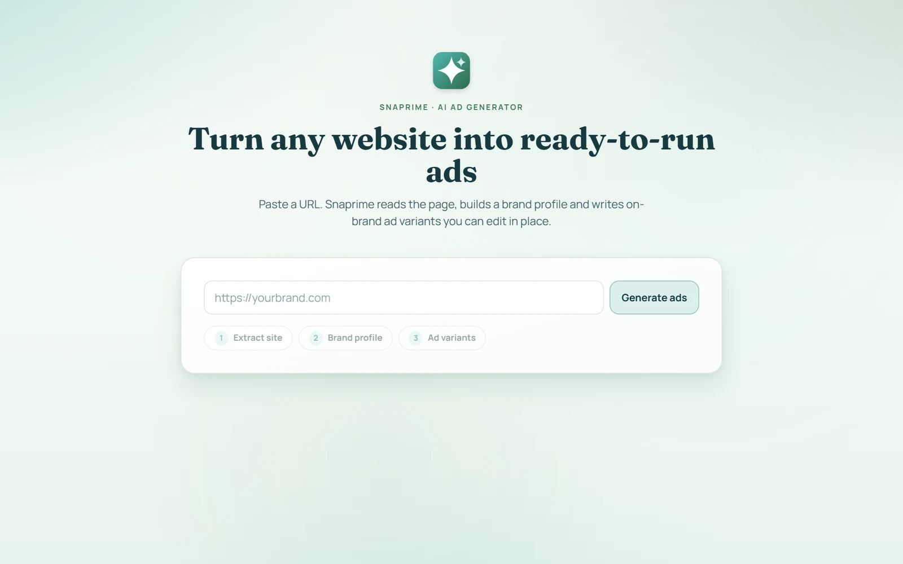
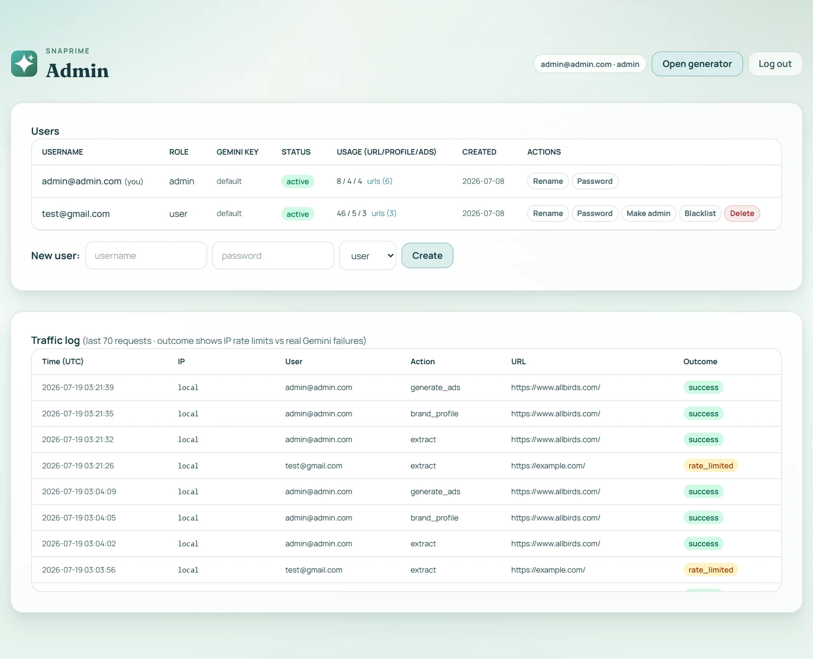

#  Snaprime - turn any website into ready-to-run ads

[](https://snaprime.aviceday.workers.dev)


**No sign-up, no login** - paste a URL, get on-brand ad variants.

Snaprime reads a landing page, builds a structured brand profile with Gemini, writes 1–3 ad variants that only use facts found on the page, and renders them as editable sponsored-post mockups.

> **My role.** Solo project, built by me with an AI coding agent - I owned the
> architecture, every technical decision below, and the debugging and
> production hardening.



## What a run looks like

Paste a URL → Snaprime extracts the site → generates a brand profile (audience, value proposition, tone, brand colors, candidate ad images) → writes ad variants that pick their images from the page. Every text field is editable in place with debounced autosave, images are swappable, and each ad can be regenerated independently without touching the others:


## How it works

1. Visitor submits a URL (`POST /api/extract`; per-IP rate limit checked first).
2. Server fetches the page with browser-like headers. The HTML is parsed with **HTMLRewriter** (Workers-native streaming parser - no DOM library): visible text, meta tags, images (src + alt, relative URLs resolved, entities decoded).
3. **JS-shell heuristic**: < 300 chars of visible text *and* scripts present → re-render through Cloudflare Browser Rendering (puppeteer against the `BROWSER` binding) and re-extract. Small pages *without* scripts correctly stay on the fast path. The path taken + reason is surfaced in the "Extraction details" tab and logs.
4. Extracted text (capped at 15k chars) + image list go to Gemini with a **structured-output schema** (`responseSchema`) → brand profile. The prompt hard-requires `"not found"` for anything the page doesn't support, and candidate images may only be picked verbatim from the supplied list.
5. The profile JSON (only ~700 tokens - page text is never re-sent) goes to a second Gemini call → 1–3 ad variants (concept, primary text, headline, description, CTA, image). Copy must match `brand_tone`; no facts beyond the profile; `image_url` is re-validated server-side against the candidate list (invalid → nulled, never invented).
6. Each ad is persisted as its own D1 row (UUID, source URL, brand-profile snapshot, timestamps) and rendered as a **sponsored-post mockup** - editable in place, image swappable (page candidates or ≤600KB upload), independently regenerable.

## Engineering highlights

**Anti-hallucination, enforced twice.** The prompt requires `"not found"` for unsupported facts and forbids invented claims/stats; the code then re-validates every image URL against the candidate list (anything not on the page is nulled, never fabricated). Both LLM calls use native `responseSchema` structured output, so there's no freeform-JSON parsing - and responses are still coerced field-by-field server-side.

**Concurrency: edits vs regeneration, no clobbering.** Two layers:
- *Between ads* - every write is a single-row `UPDATE … WHERE id = ?`; regeneration reads the brand-profile snapshot from that ad's own row, so cross-ad interference is structurally impossible.
- *Same ad* - optimistic locking: every write carries the `updated_at` the client last saw (`WHERE id = ? AND updated_at = ?`). A stale write changes 0 rows → **409** with current server state; the UI reloads the card and says so. Verified with interleaved edit/regenerate calls locally and in production.

**Graceful degradation - a visitor always sees output.** Extraction never hard-fails: dead domain, bot-blocked page, non-HTML URL, or an empty JS shell whose render also fails all return HTTP 200 with whatever was extracted plus a `warnings` list, and the UI shows a "Partial result" panel that disables steps lacking input. Above that, the two *systemic* failure modes - exceeding the IP rate limit, or Gemini being down / out of quota - fall back to a **real captured run** ([`src/lib/sampleData.json`](src/lib/sampleData.json), genuine pipeline output against allbirds.com) rendered in the exact same layout, with a friendly explanation instead of a raw error.


**Rate limiting on a public endpoint.** The generator is fully public and per-IP rate-limited (`PUBLIC_LIMIT_PER_HOUR`, default 12 API calls ≈ 4 full runs/hour) via one indexed `COUNT(*)` per request against the same table that logs traffic - no extra infrastructure. Every request is logged to D1 with IP, timestamp, URL, and a **typed outcome** (`success`, `rate_limited`, `gemini_error`, `error`), so the IP limit and a real upstream failure are never conflated.

**Cost / latency caps, surfaced in the UI and logs.** Both LLM calls have a 15s hard timeout (abort signal + HTTP timeout), input capped at 15k chars, output capped at 1024/2048 tokens, and no retry loops. Every call logs `model, latencyMs, promptTokens, outputTokens, costUsd, error` (via `wrangler tail`), and the UI shows an "AI usage for this page" panel: total calls, time, and estimated cost with a per-call breakdown (estimated at paid-tier list prices - $0 actual on free tier). The IP limit keeps a public deployment inside the free tier by construction.

## Key decisions

- **D1 over Neon/Postgres** - native Workers binding, local emulation for free, migrations built in; no connection strings or second vendor at this scale.
- **D1-backed rate limiting over Durable Objects** - one indexed `COUNT(*)` against the table that already logs traffic; the admin traffic log doubles as the limiter's audit trail.
- **Cloudflare Browser Rendering over Browserless** - one line of wrangler config, no API key, free tier is plenty, works in local dev.
- **HTMLRewriter over an HTML-parsing library** - Workers-native, streaming, zero dependencies; extraction is fully generic (no per-domain selectors anywhere).
- **`@google/genai` on the Gemini free tier** - the current SDK (`@google/generative-ai` is legacy); `gemini-2.5-flash` by default with a `GEMINI_MODEL` override. Thinking is disabled for 2.5 models (`thinkingBudget: 0`) because thinking tokens count against `maxOutputTokens` and truncate the JSON. For production ad copy I'd A/B a stronger model - extraction and generation have different quality bars.
- **A real captured run as the demo fallback** - genuine pipeline output, not marketing lorem ipsum; refresh it by logging in (bypasses the limit), running any site, and saving the three API responses into `sampleData.json`.
- **Basic SSRF guard** - non-http(s) schemes, localhost, and private IP ranges are rejected before fetching.

## Admin area

`/admin` - user management (create/rename/reset password/role/blacklist/delete), per-user Gemini API keys with env fallback, per-user usage stats with the exact URLs tested, and the **traffic log**: the last 200 requests with IP, identity, action, URL, and color-coded outcome. Anonymous visitors are recorded under a seeded public identity, so public traffic shows up next to real accounts. Logged-in accounts bypass the public rate limit.



## Stack

- **TanStack Start + TypeScript** (official `create-cloudflare` template, `@cloudflare/vite-plugin`)
- **Cloudflare Workers** for hosting, **D1** for persistence (ads, users, sessions, usage/traffic events; `wrangler d1 migrations`)
- **Google Gemini** (`@google/genai`, `gemini-2.5-flash`, configurable via `GEMINI_MODEL`) for profile + ad generation
- **Cloudflare Browser Rendering** for JS-rendered pages
- Tailwind v4 + a small custom design system (glass panels, Fraunces/Manrope) - no UI libraries

## Configuration

| Variable | Where | Purpose |
|---|---|---|
| `GEMINI_API_KEY` | secret (`wrangler secret put`) / `.dev.vars` | Gemini API key (free at aistudio.google.com/apikey) |
| `GEMINI_MODEL` | `wrangler.jsonc` vars | model id, default `gemini-2.5-flash` |
| `PUBLIC_LIMIT_PER_HOUR` | `wrangler.jsonc` vars | generator API calls allowed per IP per hour (default 12; ~3 calls per full run) |
| `PUBLIC_USER_ID` | `wrangler.jsonc` vars | identity recorded in the traffic log for anonymous visitors (default: the seeded public account) |

`.dev.vars` overrides any of these locally (restart the dev server after changing it).

## Known limitations

- Browser Rendering free tier is ~10 browser-minutes/day - heavy JS-page testing can exhaust it (plain-fetch pages are unaffected; the failure surfaces as a warning, not a crash).
- Per-IP limiting is the right tool for a demo, not for adversarial traffic - a determined attacker rotates IPs; Cloudflare WAF/Turnstile is the next layer if that ever matters.
- Uploaded ad images are stored as data-URLs in D1 (≤600KB cap). Fine at this scale; R2 is the production answer.
- No per-URL caching of extraction or profiles yet; every submission re-fetches and re-generates. Next step: D1-keyed cache with a TTL.

## Debugging highlights

My rule throughout: never trust a green build - I exercised every feature over HTTP before calling it done, which is what surfaced the bugs below. Each of these was a non-obvious root-cause found by inspecting real runtime behavior, not the error message:

- **Truncated JSON from Gemini 2.5-flash.** Responses were cut off mid-object. Root cause: 2.5-flash is a thinking model and thinking tokens count against `maxOutputTokens`, silently eating the budget before the JSON finished. Fixed by setting `thinkingBudget: 0` for 2.5-family models.
- **Words running together in extracted text** (`"Example DomainThis domain…"`). Traced to HTMLRewriter delivering its end-of-text-node flag on a trailing *empty* chunk, which the naive text collector skipped - a subtle streaming-parser contract found only by diffing actual output against the source HTML.
- **Dead domains producing "successful" extractions** - of Chrome's own error page, via the headless fallback. Fixed by distinguishing genuine navigation errors from timeouts before trusting the rendered DOM.
- **A prod-only "invalid API key" that worked locally.** The Gemini secret had been corrupted by a PowerShell pipe appending a CRLF; `wrangler secret put` stored it verbatim. Re-set via `printf` and added a defensive `.trim()` so a stray newline can never break it again.
- **Tailwind v4 cascade layers.** The template's unlayered `a { color }` and dark-mode CSS variables silently overrode utility classes. Fixed by pinning the theme and scoping the template rule to `a:not([class])`.
- **A rate-limit config that silently didn't apply** - a `.dev.vars` override was still commented out; caught only because I re-tested the limit end-to-end instead of assuming the edit took effect.

## Running locally

```bash
npm install
cp .dev.vars.example .dev.vars   # put your GEMINI_API_KEY in it
npm run db:migrate               # apply migrations to local D1
npm run dev                      # http://localhost:3000
```

Generator: `http://localhost:3000` (public). Admin: `http://localhost:3000/admin`. The migration (`migrations/0003_users.sql`) seeds an admin and a regular test account; the usernames and their initial passwords are documented in that file - rotate both before any long-lived deployment.

## Deploying

```bash
npx wrangler login
npx wrangler d1 create snaprime-db          # once; put the id in wrangler.jsonc
npm run db:migrate:remote                   # apply migrations to production D1
npx wrangler secret put GEMINI_API_KEY      # once
npm run deploy
```

## Useful scripts

| Command | Purpose |
|---|---|
| `npm run dev` | local dev (real workerd runtime, local D1 + local Browser Rendering) |
| `npm run test` | vitest |
| `npm run db:migrate` / `db:migrate:remote` | apply D1 migrations locally / in production |
| `npx wrangler d1 migrations create snaprime-db <name>` | new migration |
| `npm run cf-typegen` | regenerate `Env` types after changing `wrangler.jsonc` |
| `npm run deploy` | build + deploy |
